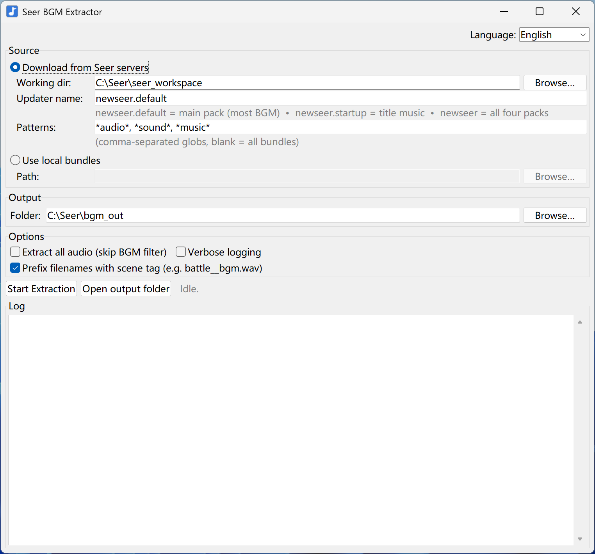

# seer-unity-audios

**Extract background music (BGM) from the Unity client of the game [Seer (赛尔号)](https://seer.61.com).**

**English** · [中文](README.md)

<p align="center">
  
</p>

Built on top of two open-source projects from [SeerAPI](https://github.com/SeerAPI):
[albi0](https://github.com/SeerAPI/albi0) for downloading Unity asset bundles, and
[UnityPy](https://github.com/K0lb3/UnityPy) for decoding `AudioClip` objects out of them.

> ⚠️ **Note**: Only the **Unity build** of Seer is supported. Flash and H5 versions use different asset formats and are not handled.

## Features

- 🎵 **One-click BGM extraction.** Hit Start, get WAV files.
- 🌐 **Downloads directly from the official Seer CDN** via `albi0`, no game installation required.
- 🔄 **Weekly-update friendly.** Re-run after a game update; only new/changed BGM is added (content-hash dedup).
- 🏷️ **Scene-tagged filenames.** Files like `mainstoryline__01_bgm.wav` derived from each clip's Unity project path.
- 🖥️ **Two flavours:** a single-file Windows `.exe` GUI for non-technical users, and a CLI for scripting.
- 🌏 **Bilingual UI** (English / 中文), with auto-detection from system locale.
- 📦 **Portable.** The exe doesn't need Python installed and isn't tied to a specific folder — drop it on a USB stick if you like.

## Quickstart (GUI, no Python needed)

1. Download `SeerBGMExtractor.exe` from the latest [Release](../../releases).
2. Put it in any folder you have write access to (e.g. `D:\SeerBGM\`).
3. Double-click. Pick a language if you want. Click **Start Extraction**.
4. When done, click **Open output folder** to see your BGM files.

That's it. The first download is a few hundred MB; subsequent runs only pull what changed.

## Run from source

Requires Python 3.10+.

```bash
git clone https://github.com/Lin-Xavier/seer-unity-audios.git
cd seer-unity-audios
pip install -r requirements.txt
python seer_bgm_gui.py        # GUI
# or
python extract_seer_bgm.py --download -o ./bgm   # CLI
```

## Build the EXE yourself

On a Windows machine with Python 3.10+ on PATH:

```bat
build.bat
```

Output: `dist\SeerBGMExtractor.exe` — a single-file, no-console Windows binary (~60–90 MB) with all dependencies bundled. The icon is regenerated from `make_icon.py` each build.

## CLI usage

End-to-end (download + extract):

```bash
python extract_seer_bgm.py --download -o ./bgm
```

If you already have downloaded bundles:

```bash
python extract_seer_bgm.py /path/to/bundles -o ./bgm
```

Restrict the download to audio-looking bundles (saves bandwidth):

```bash
python extract_seer_bgm.py --download \
    --pattern '*audio*' --pattern '*sound*' --pattern '*music*' \
    -o ./bgm
```

Extract every audio clip without filtering (useful for exploration):

```bash
python extract_seer_bgm.py ./bundles --all-audio -v -o ./all_audio
```

Available updaters (download groups):

| Updater | Source package | Contains |
|---|---|---|
| `newseer.default` *(default)* | `DefaultPackage` | General game assets — **most BGM lives here** |
| `newseer.startup` | `StartupPackage` | Startup / title screen |
| `newseer.config`  | `ConfigPackage`  | Config data — no audio |
| `newseer.pet`     | `PetAnimPackage` | Pet animations — mostly SFX |
| `newseer` *(group)* | all four         | Everything (largest download) |

See `python extract_seer_bgm.py --help` for the full flag list.

## How it works

```
┌─────────────────┐    ┌─────────────────┐    ┌─────────────────────┐
│  albi0 update   │──▶│  bundle files    │──▶│  UnityPy AudioClip   │
│ (newseer.*)     │    │  on local disk   │    │  → WAV files         │
└─────────────────┘    └─────────────────┘    └─────────────────────┘
                                                       │
                                                       ▼
                                              BGM heuristic filter
                                              (name patterns + length)
                                                       │
                                                       ▼
                                              Scene tag from each clip's
                                              m_Container path
                                                       │
                                                       ▼
                                                  ./bgm_out/
```

A clip is treated as BGM if **any** of these are true:

- Filename matches `bgm`, `music`, `bg_`, `theme`, `battle.*music`, or `ost`
- Clip is at least 15 seconds long

…and clips with SFX-like names (`sfx_`, `voice`, `click`, `hit`, etc.) are excluded.

Bundle detection is **magic-byte based**, not extension-based — YooAsset (which `newseer` uses) sometimes writes hash-named files with no extension, and they're picked up correctly.

## File layout

```
.
├── docs/
│   ├── screenshot-cn.png         ← Chinese GUI screenshot
│   └── screenshot-en.png         ← English GUI screenshot
├── README.md                     ← Chinese version (GitHub default)
├── README.en.md                  ← English version
├── extract_seer_bgm.py           ← core extraction logic + CLI
├── seer_bgm_gui.py               ← Tkinter GUI (uses extract_seer_bgm)
├── make_icon.py                  ← regenerates app_icon.ico
├── app_icon.ico                  ← committed icon
├── build.bat                     ← Windows build → dist\SeerBGMExtractor.exe
├── run_from_source.bat           ← run the GUI without building
├── requirements.txt
├── diagnose_scene_info.py        ← exploration tool (m_Container paths, AudioSource refs)
└── diagnose_monobehaviour.py     ← exploration tool (scene config heuristics)
```

## Acknowledgments

- [**SeerAPI**](https://github.com/SeerAPI) for the `albi0` downloader and the `newseer` plugin that knows how to talk to Seer's CDN.
- [**UnityPy**](https://github.com/K0lb3/UnityPy) by K0lb3 for Unity AssetBundle parsing.
- The **FMOD** team (via `fmod_toolkit`) for audio decoding.

## Caveats

- **Plugin name drift.** If `albi0` ever renames an updater, run `albi0 list` and pass the correct name via `--updater-name` / the GUI field.
- **Scene-config extraction was investigated but not pursued.** Diagnostics revealed that Seer's IL2CPP-compiled scene logic isn't exposed in the asset bundles, so the scene tag is derived from each clip's Unity project path (`m_Container`) rather than from runtime audio bindings. Good enough in practice; explained in detail in the source comments.
- **Copyright.** The extracted music is owned by the game's publisher (淘米). Personal listening is generally low-risk; redistribution, reupload, or reuse in derivative works is a copyright issue. Use accordingly.

## License

MIT — see [LICENSE](LICENSE).
