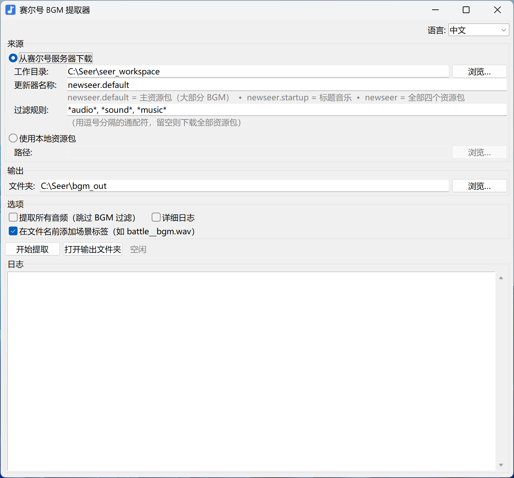

# seer-unity-audios

**从 [赛尔号](https://seer.61.com) Unity 客户端提取游戏背景音乐（BGM）的工具。**

[English](README.en.md) · **中文**

<p align="center">
  
</p>

基于 [SeerAPI](https://github.com/SeerAPI) 的两个开源项目构建：
[albi0](https://github.com/SeerAPI/albi0) 用于下载 Unity 资源包，[UnityPy](https://github.com/K0lb3/UnityPy) 用于解码其中的 `AudioClip` 对象。

> ⚠️ **注意**：本工具仅支持 **Unity 端**赛尔号。Flash 端和 H5 端使用完全不同的资源格式，不在支持范围内。

## 特性

- 🎵 **一键提取 BGM**：点击开始，得到 WAV 文件。
- 🌐 **直接从赛尔号官方 CDN 下载**（通过 `albi0`），无需安装游戏客户端。
- 🔄 **支持每周更新**：游戏更新后再运行一次，只会下载和提取新增的 BGM（内容哈希去重）。
- 🏷️ **场景标签命名**：文件命名如 `mainstoryline__01_bgm.wav`，标签源自资源在 Unity 项目中的路径。
- 🖥️ **两种使用方式**：面向普通用户的单文件 Windows `.exe` 图形界面，以及可脚本化的命令行版本。
- 🌏 **双语界面**（English / 中文），首次运行时根据系统语言自动选择。
- 📦 **可移植**：exe 不需要 Python 运行环境，也不依赖固定路径——放在 U 盘里也能用。

## 快速开始（GUI 版本，无需 Python）

1. 从最新 [Release](../../releases) 页面下载 `SeerBGMExtractor.exe`。
2. 放到任意有写权限的文件夹中（如 `D:\SeerBGM\`）。
3. 双击运行。如有需要，可在右上角选择语言。点击**开始提取**。
4. 完成后点击**打开输出文件夹**查看提取出的 BGM 文件。

完成。首次完整下载约几百 MB，后续运行只会下载有变化的部分。

## 从源码运行

需要 Python 3.10+：

```bash
git clone https://github.com/Lin-Xavier/seer-unity-audios.git
cd seer-unity-audios
pip install -r requirements.txt
python seer_bgm_gui.py        # 图形界面版本
# 或
python extract_seer_bgm.py --download -o ./bgm   # 命令行版本
```

## 自行构建 EXE

在已安装 Python 3.10+ 且加入 PATH 的 Windows 机器上：

```bat
build.bat
```

输出文件：`dist\SeerBGMExtractor.exe`——单文件、无控制台窗口的 Windows 可执行文件（约 60–90 MB），所有依赖都打包在内。每次构建时会通过 `make_icon.py` 重新生成图标。

## 命令行用法

下载并提取（一条命令完成）：

```bash
python extract_seer_bgm.py --download -o ./bgm
```

如果已有下载好的资源包：

```bash
python extract_seer_bgm.py /资源包路径 -o ./bgm
```

通过模式过滤限制下载范围，节省带宽：

```bash
python extract_seer_bgm.py --download \
    --pattern '*audio*' --pattern '*sound*' --pattern '*music*' \
    -o ./bgm
```

提取所有音频，不进行 BGM 过滤（适合探索性用途）：

```bash
python extract_seer_bgm.py ./bundles --all-audio -v -o ./all_audio
```

可用的更新器（下载组）：

| 更新器 | 资源包 | 包含内容 |
|---|---|---|
| `newseer.default` *（默认）* | `DefaultPackage` | 通用游戏资源——**大部分 BGM 在这里** |
| `newseer.startup` | `StartupPackage` | 启动 / 标题画面 |
| `newseer.config`  | `ConfigPackage`  | 配置数据——无音频 |
| `newseer.pet`     | `PetAnimPackage` | 精灵动画——主要是音效（SFX） |
| `newseer` *（组）* | 以上四个 | 全部内容（下载量最大） |

完整参数列表请运行 `python extract_seer_bgm.py --help`。

## 工作原理

```
┌─────────────────┐    ┌─────────────────┐    ┌─────────────────────┐
│  albi0 下载     │──▶│  本地资源包文件  │──▶│  UnityPy 解码         │
│ (newseer.*)     │    │                  │    │  AudioClip → WAV     │
└─────────────────┘    └─────────────────┘    └─────────────────────┘
                                                       │
                                                       ▼
                                              BGM 启发式过滤
                                              （名称匹配 + 时长判断）
                                                       │
                                                       ▼
                                              从每个 AudioClip 的
                                              m_Container 路径提取场景标签
                                                       │
                                                       ▼
                                                  ./bgm_out/
```

满足以下**任一**条件时，AudioClip 会被识别为 BGM：

- 文件名包含 `bgm`、`music`、`bg_`、`theme`、`battle.*music` 或 `ost`
- 音频时长 ≥ 15 秒

同时排除名称符合音效模式的文件（如 `sfx_`、`voice`、`click`、`hit` 等）。

资源包通过**文件魔数（magic bytes）**识别，而非依赖文件扩展名——YooAsset（即 `newseer` 使用的资源系统）有时会写出无扩展名的哈希命名文件，这种情况也能正确识别。

## 文件结构

```
.
├── docs/
│   ├── screenshot-cn.png         ← 中文界面截图
│   └── screenshot-en.png         ← 英文界面截图
├── README.md                     ← 中文说明（GitHub 默认显示）
├── README.en.md                  ← 英文说明
├── extract_seer_bgm.py           ← 核心提取逻辑与命令行入口
├── seer_bgm_gui.py               ← Tkinter 图形界面
├── make_icon.py                  ← 重新生成 app_icon.ico
├── app_icon.ico                  ← 已提交的图标
├── build.bat                     ← Windows 构建脚本
├── run_from_source.bat           ← 不构建直接运行 GUI
├── requirements.txt
├── diagnose_scene_info.py        ← 探索性工具（m_Container 路径、AudioSource 引用）
└── diagnose_monobehaviour.py     ← 探索性工具（场景配置启发式分析）
```

## 致谢

- [**SeerAPI**](https://github.com/SeerAPI) 提供的 `albi0` 下载器和理解赛尔号 CDN 协议的 `newseer` 插件。
- K0lb3 的 [**UnityPy**](https://github.com/K0lb3/UnityPy) 用于 Unity AssetBundle 解析。
- **FMOD** 团队（通过 `fmod_toolkit`）提供的音频解码支持。

## 注意事项

- **更新器名称可能变化**：如果 `albi0` 后续版本重命名了更新器，运行 `albi0 list` 查看正确名称，通过 `--updater-name` 或界面字段传入。
- **场景配置提取经过研究但未实现**：通过诊断脚本发现赛尔号的 IL2CPP 编译过的场景逻辑并不暴露在资源包内，因此场景标签来源于每个音频的 Unity 项目路径（`m_Container`），而不是运行时的音频绑定。实测效果已足够好；技术细节见源码注释。
- **版权说明**：提取的音乐版权归游戏发行商（淘米）所有。个人收听通常风险较低；但**重新分发、二次上传、用于衍生作品都属于侵权行为**。请合理使用。

## 许可证

MIT 协议 —— 详见 [LICENSE](LICENSE)。
